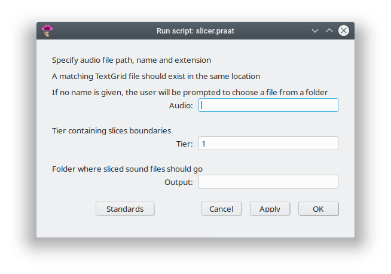

# slicer.praat

Praat script to slice a long WAV file into individual small files.

## Purpose

The scripts takes a sound file that may contain, e.g., a whole
recorded session with various sentences, slices the original file down,
writing the sound slices in individual WAV files.

## Input
A WAV sound file and a previously segmented TextGrid file with matching
name. The accompanying TextGrid should contain one interval tier. The
portion of the waveform bounded by each interval will be sliced. Only
non-empty intervals (i.e., those filled by the user with one or more
characters) will be sliced. The character string filling a given boundary
will be used to name the sliced sound enclosed by that boundary.
 
## Output
WAV sound files written in a user-specified directory sliced down
from a source wav file.

Upon running the script, a window like the one below will appear, where the user has to fill the three fields.

## Comments
Script file and user files don't need to be in the same file directory.

## License

See the [LICENSE](LICENSE.md) file for license rights and limitations.

## How to cite

Click on the DOI badge above to see instructions on how to cite the script.
